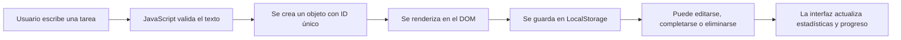

<p align="center">
  
</p>

<p align="center">
  <a href="https://lista-tareas-angel.netlify.app/" target="_blank">
    
  </a>
</p>

<p align="center">
  <a href="https://lista-tareas-angel.netlify.app/">
    
  </a>
  
  
  
</p>

---

## 📝 Descripción

**Lista de Tareas JS** es una aplicación web moderna para gestionar pendientes desde el navegador.  
Está construida con **HTML**, **CSS** y **JavaScript puro**, sin frameworks, e incluye persistencia con `LocalStorage`, filtros, edición de tareas, modo claro/oscuro y animaciones suaves.

<p align="center">
  <a href="https://lista-tareas-angel.netlify.app/">
    
  </a>
</p>

---

## 🎬 Vista previa animada

<p align="center">
  
</p>


=======
--

## ✨ Funcionalidades

<table>
  <tr>
    <td>✅ Agregar tareas</td>
    <td>Crea tareas rápidamente desde el input principal.</td>
  </tr>
  <tr>
    <td>🎯 Marcar como completadas</td>
    <td>Cambia el estado de cada tarea con un solo clic.</td>
  </tr>
  <tr>
    <td>✏️ Editar tareas</td>
    <td>Edita una tarea sin borrar ni volver a crearla.</td>
  </tr>
  <tr>
    <td>🗑️ Eliminar tareas</td>
    <td>Borra tareas individuales con animación de salida.</td>
  </tr>
  <tr>
    <td>🔎 Filtrar tareas</td>
    <td>Visualiza todas, pendientes o completadas.</td>
  </tr>
  <tr>
    <td>📊 Progreso visual</td>
    <td>Muestra el porcentaje de tareas completadas.</td>
  </tr>
  <tr>
    <td>🌙 Modo oscuro/claro</td>
    <td>Permite cambiar el tema y guarda la preferencia.</td>
  </tr>
  <tr>
    <td>💾 LocalStorage</td>
    <td>Guarda tareas y configuración en el navegador.</td>
  </tr>
  <tr>
    <td>📱 Diseño responsive</td>
    <td>Se adapta a pantallas móviles y escritorio.</td>
  </tr>
</table>

---

## 🛠️ Tecnologías utilizadas

<p align="center">
  
  
  
  
</p>

---

## 🧠 ¿Cómo funciona?



---

## 📂 Estructura del proyecto

```bash
lista-tareas-js/
│
├── index.html        # Estructura principal de la aplicación
├── style.css         # Estilos, animaciones y diseño responsive
├── script.js         # Lógica de tareas, filtros, tema y LocalStorage
├── assets/
│   ├── demo.gif      # Vista previa animada para el README
│   └── preview.png   # Captura del proyecto
└── README.md         # Documentación del proyecto
```

---

## 🚀 Instalación y uso

```bash
# 1. Clonar el repositorio
git clone https://github.com/angelcamayojm-wq/lista-tareas-js.git

# 2. Entrar a la carpeta del proyecto
cd lista-tareas-js

# 3. Abrir index.html en tu navegador
```

También puedes abrir directamente el archivo `index.html` con doble clic.

---

## 📌 Conceptos practicados

- Manipulación del **DOM**
- Eventos con **addEventListener**
- Validación de formularios
- Persistencia con **LocalStorage**
- Uso de objetos y arrays en JavaScript
- Renderizado dinámico de elementos
- Filtros por estado
- Modo claro/oscuro con variables CSS
- Diseño responsive
- Animaciones con `@keyframes`
- Accesibilidad básica con etiquetas `aria-label`

---

## 🧪 Mejoras futuras

- [ ] Agregar fechas límite para cada tarea
- [ ] Crear categorías o etiquetas
- [ ] Permitir arrastrar y ordenar tareas
- [ ] Agregar búsqueda por texto
- [ ] Exportar tareas en JSON
- [ ] Añadir pruebas básicas de JavaScript

---

## 🤝 Contribuciones

Las ideas, mejoras y sugerencias son bienvenidas.  
Puedes hacer un fork del proyecto, crear una rama y enviar un Pull Request:

```bash
git checkout -b mejora/nueva-funcionalidad
git commit -m "Mejora la experiencia de usuario"
git push origin mejora/nueva-funcionalidad
```

---

## 👨‍💻 Autor

<p align="center">
  
</p>

<p align="center">
  <strong>Angel Rivera</strong><br />
  Desarrollador en formación, construyendo proyectos web paso a paso 🚀
</p>

<p align="center">
  <a href="https://github.com/angelcamayojm-wq">
    
  </a>
</p>

---

## 📄 Licencia

Este proyecto fue creado con fines educativos.  
Para abrirlo formalmente a contribuciones y reutilización, puedes agregar un archivo `LICENSE`, por ejemplo con licencia MIT.

---

<p align="center">
  
</p>
