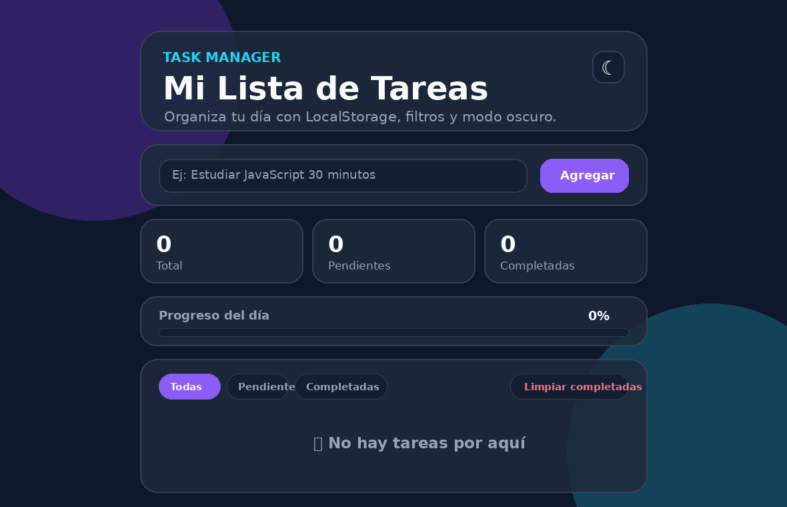
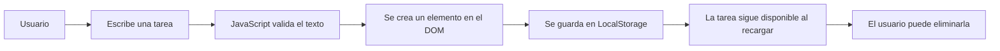

<p align="center">
  
</p>

<p align="center">
  <a href="https://lista-tareas-angel.netlify.app/" target="_blank">
    
  </a>
</p>

<p align="center">
  <a href="https://lista-tareas-angel.netlify.app/">
    
  </a>
  
  
  
</p>

---

## 📝 Descripción

**Lista de Tareas JS** es una aplicación web sencilla, rápida y práctica para gestionar tareas desde el navegador.  
Permite **agregar**, **eliminar** y **guardar tareas automáticamente** usando `LocalStorage`, por lo que tus pendientes se mantienen incluso después de recargar la página.

<p align="center">
  <a href="https://lista-tareas-angel.netlify.app/">
    
  </a>
</p>

---

## 🎬 Vista previa animada

<p align="center">
  
</p>

> 💡 **Nota:** si la animación no aparece, asegúrate de subir el archivo `assets/demo.gif` al repositorio.

---

## ✨ Funcionalidades

<table>
  <tr>
    <td>✅ Agregar tareas</td>
    <td>Escribe una tarea y añádela a la lista.</td>
  </tr>
  <tr>
    <td>🗑️ Eliminar tareas</td>
    <td>Borra tareas cuando ya no las necesites.</td>
  </tr>
  <tr>
    <td>💾 Guardado local</td>
    <td>Las tareas se almacenan en el navegador con <code>LocalStorage</code>.</td>
  </tr>
  <tr>
    <td>🔄 Persistencia</td>
    <td>Las tareas se mantienen al recargar la página.</td>
  </tr>
  <tr>
    <td>⚡ Vanilla JS</td>
    <td>Proyecto construido sin frameworks externos.</td>
  </tr>
</table>

---

## 🛠️ Tecnologías utilizadas

<p align="center">
  
  
  
  
</p>

---

## 🧠 ¿Cómo funciona?



---

## 📂 Estructura del proyecto

```bash
lista-tareas-js/
│
├── index.html        # Estructura principal de la aplicación
├── style.css         # Estilos visuales de la interfaz
├── script.js         # Lógica para agregar, eliminar y guardar tareas
├── assets/
│   └── demo.gif      # Vista previa animada para el README
└── README.md         # Documentación del proyecto
```

---

## 🚀 Instalación y uso

Sigue estos pasos para ejecutar el proyecto en tu computador:

```bash
# 1. Clonar el repositorio
git clone https://github.com/angelcamayojm-wq/lista-tareas-js.git

# 2. Entrar a la carpeta del proyecto
cd lista-tareas-js

# 3. Abrir index.html en el navegador
```

También puedes abrir directamente el archivo `index.html` con doble clic.

---

## 📌 Conceptos practicados

- Manipulación del **DOM**
- Eventos con **JavaScript**
- Uso de `addEventListener`
- Validación básica de formularios
- Persistencia de datos con `localStorage`
- Conversión de datos con `JSON.stringify()` y `JSON.parse()`

---

## 🧪 Ideas para futuras mejoras

- [ ] Marcar tareas como completadas
- [ ] Editar tareas existentes
- [ ] Agregar filtros: todas, pendientes y completadas
- [ ] Crear modo oscuro
- [ ] Usar IDs únicos para manejar tareas repetidas
- [ ] Agregar animaciones al insertar o eliminar tareas
- [ ] Mejorar accesibilidad con etiquetas ARIA
- [ ] Publicar capturas reales del proyecto

---

## 🤝 Contribuciones

Las ideas, mejoras y sugerencias son bienvenidas.  
Puedes hacer un fork del proyecto, crear una rama y enviar un Pull Request:

```bash
git checkout -b mejora/nueva-funcionalidad
git commit -m "Mejora la experiencia de usuario"
git push origin mejora/nueva-funcionalidad
```

---

## 👨‍💻 Autor

<p align="center">
  
</p>

<p align="center">
  <strong>Angel Rivera</strong><br />
  Desarrollador en formación, construyendo proyectos web paso a paso 🚀
</p>

<p align="center">
  <a href="https://github.com/angelcamayojm-wq">
    
  </a>
</p>

---

## 📄 Licencia

Este proyecto fue creado con fines educativos.  
Para abrirlo formalmente a contribuciones y reutilización, puedes agregar un archivo `LICENSE`, por ejemplo con licencia MIT.

---

<p align="center">
  
</p>
